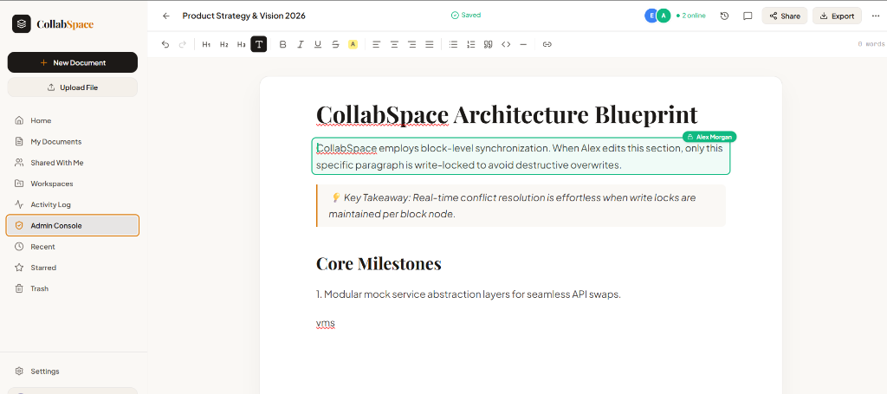
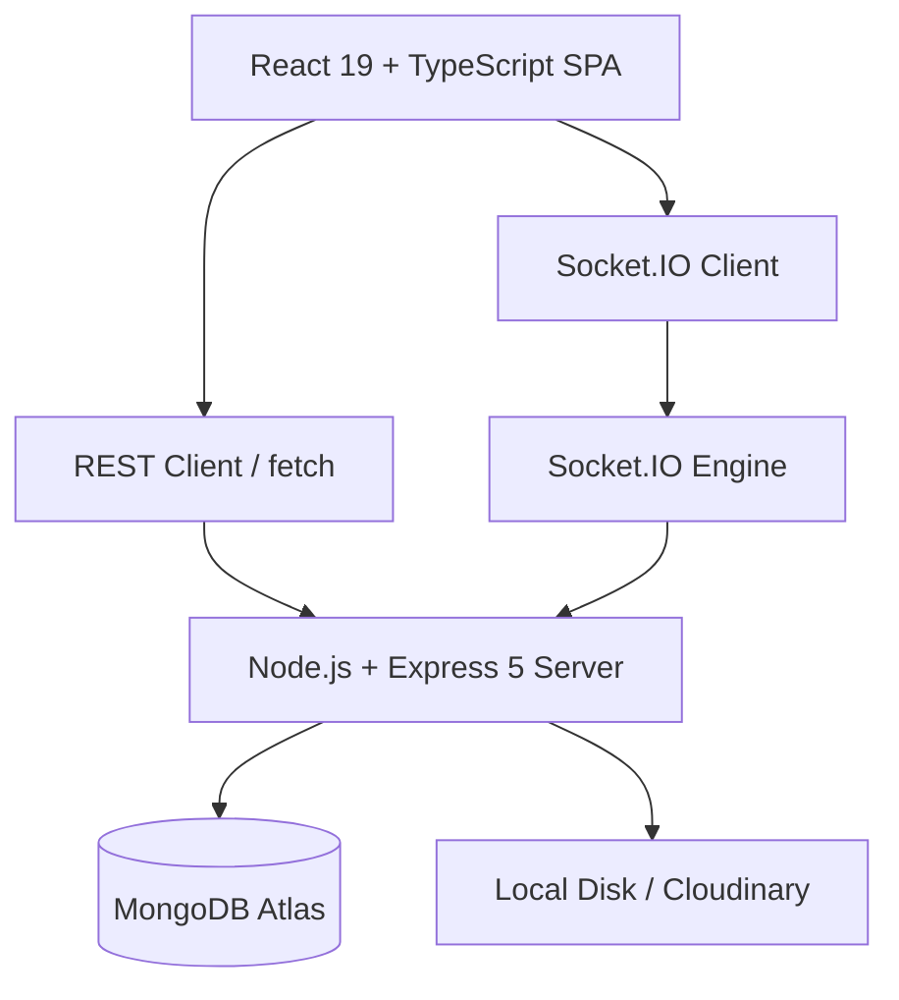

# CollabSpace

A premium, full-stack real-time collaborative document workspace featuring an elegant, human-centric editorial design.

## Overview

CollabSpace bridges the gap between structured documentation and real-time collaboration. It provides users with an aesthetic, distraction-free environment to write, share, and organize documents. Unlike generic SaaS interfaces, CollabSpace employs a tailored editorial identity using obsidian and warm amber design tokens with sophisticated typography (Playfair Display for headings and Plus Jakarta Sans for UI elements).

---

## Screenshots / Demo

### Collaborative Document Editor

*Figure 1: Active document editing viewport displaying real-time presence indicators, collaborator cursors, a context-aware chat sidebar, and an formatting toolbar.*

---

## Project Highlights

### Verified Implementation

| Area | Verified Implementation Details |
| :--- | :--- |
| **Frontend** | React 19 + TypeScript + Vite SPA |
| **Styling** | Tailwind CSS v4 + Custom Editorial Tokens |
| **Rich Text Engine**| TipTap 3 |
| **Backend** | Node.js 20+ + Express 5 |
| **Real-time** | Socket.IO 4 |
| **Database** | MongoDB Atlas via Mongoose 8 |
| **Authentication** | Stateless JWT (Bearer) + bcryptjs |
| **Validation** | Zod 3 Request Schema Validation |
| **File Storage** | Local Disk `/uploads` with optional Cloudinary SDK integration |
| **Text Extraction** | pdf-parse (PDF to plain text conversion) |

### Code-Derived Metrics

| Metric | Verified Count | Source Evidence |
| :--- | :---: | :--- |
| **REST API endpoints** | 36 | `backend/src/routes/*.ts` & `app.ts` |
| **Database Models** | 8 | `backend/src/models/*.ts` |
| **Socket.IO Client Events** | 9 | `backend/src/socket/index.ts` |
| **Socket.IO Server Events** | 11 | `backend/src/socket/index.ts` |
| **Backend Service Modules** | 5 | `backend/src/services/*.ts` |
| **Frontend Service Modules**| 5 | `frontend/src/services/*.ts` |
| **Frontend Components** | 37 | `frontend/src/components/**/*.tsx` |
| **Supported System Roles** | 3 | `ADMIN`, `MEMBER`, `GUEST` |
| **Supported Document Roles**| 3 | `OWNER`, `EDITOR`, `VIEWER` |
| **Document Export Formats** | 4 | `html`, `markdown`, `docx`, `pdf` (HTML format) |

---

## Key Features

- **Stateless Authentication:** Secure email/password login and signup with token verification.
- **Dynamic User Switcher:** In-app developer panel to instantly toggle between `ADMIN`, `MEMBER`, and `GUEST` profiles to test route guarding.
- **Interactive Rich Text Editor:** Powered by TipTap 3 with full headers, alignment, callouts, text style, highlights, and custom link bindings.
- **Local Cross-Tab Sync:** Real-time synchronization of titles, HTML content, and cursors across standard browser tabs using the Web BroadcastChannel API.
- **Granular Permissions:** Manage document collaboration access using `OWNER`, `EDITOR`, and `VIEWER` roles.
- **Side Panel Document Chat:** Context-based messaging sidebar linked directly to document rooms.
- **Manual Version History:** Create snapshots of document states, list version logs, and restore previous versions.
- **File Upload & Parsing:** Upload PDF, Markdown, and DOCX documents with drag-and-drop animations, file size validation, and backend text extraction.
- **Audit Logging:** Logs user, document, workspace, permissions, and export activities.

---

## Real-Time Collaboration

The synchronization pipeline flows directly through WebSocket connections. If WebSockets are unavailable or not configured, the client falls back to browser-local syncing.

```
[ Collaborator A ]                   [ Collaborator B ]
      │                                    ▲
      ▼ (types/moves mouse)                │ (cursor & HTML update)
[ TipTap 3 Canvas ]                  [ TipTap 3 Canvas ]
      │                                    ▲
      ▼ (document:content-update)          │ (document:content-updated)
[ Socket.IO Client ] ───────────────►[ Socket.IO Client ]
      │                                    ▲
      ▼                                    │
[ Node.js Socket.IO Room Server ] ─────────┘
      │
      ▼ (Debounced 3s)
[ MongoDB Atlas ]
```

1. **Document Join:** Connecting users enter a Socket.IO room scoped to the document ID (`doc:<documentId>`) after validation.
2. **Presence & Cursors:** Connected sockets emit `document:cursor-update` with absolute workspace offsets (`coordsAtPos`), which are broadcasted to render presence names and indicators.
3. **Block-Level Locking:** Editors acquire temporary locks on individual nodes (`block:lock`), disabling editing for other users on that block. Locks expire after five minutes of inactivity or upon socket disconnect.
4. **Chat Sync:** Per-document chat broadcasts `chat:received` events to active room sockets.

---

## Architecture



---

## Tech Stack

| Technology | Purpose |
| :--- | :--- |
| **React 19** | Dynamic Single Page Application rendering |
| **Vite 8** | Modern, fast build server and frontend bundler |
| **Tailwind CSS v4** | Modern, utility-first styling with native CSS variables |
| **TipTap 3** | Headless extensible rich text editing framework |
| **Node.js 20+** | Extensible backend Javascript runtime |
| **Express 5** | RESTful HTTP controllers and server routing |
| **Socket.IO 4** | Bidirectional real-time client-server communication |
| **Mongoose 8** | Schematized MongoDB Object Document Mapper (ODM) |
| **Zod 3** | Strict HTTP request schema validation |
| **pdf-parse** | Server-side text parsing for document uploads |

---

## Project Structure

```text
backend/
├── src/
│   ├── config/        # Cloudinary, Database, and Env Configuration
│   ├── controllers/   # REST Controllers (Auth, Docs, Workspaces, Uploads)
│   ├── middleware/    # Auth token check, Multer, Error handlers
│   ├── models/        # Mongoose database schemas
│   ├── routes/        # Versioned routes (/api/v1/*)
│   ├── services/      # Business logic (Extractors, Document CRUD, Workspaces)
│   ├── socket/        # Socket.IO connection, room, and lock handlers
│   └── validators/    # Zod schemas for request validation
frontend/
├── src/
│   ├── api/           # API fetch client and contract TypeScript definitions
│   ├── components/    # Landing sections, Auth, Dashboard, and Editor components
│   ├── context/       # AuthProvider context
│   ├── services/      # Frontend service adapters mirroring backend endpoints
│   └── types/         # Domain TypeScript models
```

---

## Authentication & Authorization

- **Stateless JWT Sessions:** Signup and login issue a signed JSON Web Token containing the user's ID.
- **Header Injection:** Protected routes require an `Authorization: Bearer <token>` header. Socket.IO connections pass the JWT within the handshake authentication block.
- **Password Protection:** User passwords are encrypted on the backend using `bcryptjs` with a cost factor of 10.
- **Route Guards:** If a user with `MEMBER` or `GUEST` privileges tries to access the Admin Console, a guard overlay redirects them.

---

## Document Permissions

Permissions are verified in database operations and Socket.IO middleware using the following role mappings:

| Action | Owner | Editor | Viewer | Guest |
| :--- | :---: | :---: | :---: | :---: |
| **Edit Document Text** | Yes | Yes | No | No |
| **Modify Document Title** | Yes | Yes | No | No |
| **Invite Collaborators** | Yes | No | No | No |
| **Change Access Levels** | Yes | No | No | No |
| **Restore Version History**| Yes | Yes | No | No |
| **Delete/Trash Document** | Yes | No | No | No |
| **View Content / Chat** | Yes | Yes | Yes | Yes |

---

## Real-Time Communication Events

### Incoming (Client to Server)

| Event Name | Parameter Data | Trigger / Purpose |
| :--- | :--- | :--- |
| `document:join` | `{ documentId }` | Authenticate and join document-scoped room |
| `document:leave` | `{ documentId }` | Cleanly leave document room |
| `document:cursor-update` | `{ documentId, cursor }` | Broadcast cursor position inside the editor |
| `block:lock` | `{ documentId, blockId, blockIndex }` | Request edit lock on a paragraph node |
| `block:unlock` | `{ documentId, blockId }` | Release edit lock on a paragraph node |
| `document:content-update`| `{ documentId, html }` | Broadcast content updates to active editors |
| `document:title-update` | `{ documentId, title }` | Update document title and sync database |
| `chat:send` | `{ documentId, content }` | Save chat message and push to collaborators |
| `disconnect` | None | Clear presence lists and release active block locks |

### Outgoing (Server to Client)

| Event Name | Broadcast Scope | Renders / Actions |
| :--- | :--- | :--- |
| `document:role-updated` | Room | Alerts user of permission modification |
| `document:access-revoked`| Room | Redirects user if document access is removed |
| `block:locked` | Room (others) | Renders block locks and editor name indicator |
| `block:unlocked` | Room (others) | Removes typing lock overlay |
| `document:user-joined` | Room (others) | Displays notification toast or cursor |
| `document:user-left` | Room (others) | Cleans up cursor overlay |
| `document:presence` | Room | Synchronizes the active user header |
| `document:cursor-updated`| Room (others) | Moves collaborator cursors on the canvas |
| `document:content-updated`| Room (others) | Modifies client TipTap text content |
| `document:title-updated` | Room (others) | Changes active navbar document title |
| `chat:received` | Room | appends message to active chat log sidebar |

---

## Database Design

The database contains **8 Mongoose schemas** matching the application logic:

1. **`User`**: Core accounts containing credentials, system roles (`ADMIN`, `MEMBER`, `GUEST`), and suspension status.
2. **`Document`**: Document metadata, collaborators array, stars tracker, trash indicator, and block items.
3. **`DocumentVersion`**: Document snapshots for version restoration.
4. **`Workspace`**: Isolated spaces mapping to specific document grids.
5. **`Invitation`**: Tracks workspace access tokens.
6. **`Activity`**: Audit trail documents for user audit feeds.
7. **`ChatMessage`**: Persistent logs for per-document chat panels.
8. **`OrgSettings`**: Central configurations for 2FA, SSO, session timeouts, and public link policies.

---

## REST API Reference

All requests must be made to `/api/v1`.

### Authentication
- `POST /auth/signup` - Registers a new user account.
- `POST /auth/login` - Authenticates credentials and returns a JWT.
- `POST /auth/logout` - Performs client-side session clearance.
- `GET /auth/me` - Resolves details of the authenticated account.

### Documents
- `POST /documents` - Creates a blank or templated document.
- `GET /documents` - Returns all documents accessible by the user.
- `GET /documents/:id` - Fetch document info by MongoDB ID.
- `PATCH /documents/:id` - Update document metadata or content.
- `DELETE /documents/:id` - Moves document to trash.
- `DELETE /documents/:id/permanent` - Destroys document from collection.
- `POST /documents/:id/restore` - Reverts document back from trash.
- `POST /documents/:id/star` - Toggles starred property.
- `POST /documents/:id/join` - Joins document via public invitation link.
- `POST /documents/:id/collaborators` - Add user with specified document role.
- `PATCH /documents/:id/collaborators/:userId` - Update collaborator role.
- `DELETE /documents/:id/collaborators/:userId` - Remove collaborator access.
- `PATCH /documents/:id/access` - Toggles document visibility (public/restricted).
- `POST /documents/:id/versions` - Creates manual snapshot version.
- `GET /documents/:id/versions` - List all version logs.
- `GET /documents/:id/versions/:versionId` - Returns details of a manual version.
- `GET /documents/:id/export/:format` - Returns document in `html`, `markdown`, `docx`, or `pdf` (HTML output).

### Workspaces
- `POST /workspaces` - Creates a workspace.
- `GET /workspaces` - Lists all user-accessible workspaces.
- `GET /workspaces/:id` - Retrieves a specific workspace.
- `GET /workspaces/:id/members` - Lists members of the workspace.
- `DELETE /workspaces/:id/members/:userId` - Removes workspace member.
- `POST /workspaces/:id/invitations` - Invites user to workspace.
- `DELETE /workspaces/:id` - Deletes workspace and drops documents.

### Invitations
- `GET /invitations` - List pending workspace invites.
- `POST /invitations/:id/accept` - Joins target workspace.
- `POST /invitations/:id/reject` - Rejects invitation.

### Chat & Activities
- `GET /documents/:id/chat` - Fetch up to 100 historical chat messages.
- `GET /activities` - Fetch system logs with sorting parameters.

### Uploads
- `POST /upload/avatar` - Upload profile picture.
- `POST /upload/document` - Upload document file to parse.

---

## Testing

No automated test suite is currently configured in the repository. Commands are limited to code verification tools:
- **Backend Typecheck:** `npm run typecheck`
- **Backend Compiler Verification:** `npm run build`
- **Frontend Build & Linter Check:** `npm run build` & `npm run lint`

---

## Local Development Setup

### Prerequisites
- Node.js 20.0.0 or higher.
- A running MongoDB service (local or MongoDB Atlas).

### 1. Backend Setup
```bash
cd backend
npm install
# Copy backend/.env.example to backend/.env and populate your parameters
npm run dev
```

### 2. Frontend Setup
```bash
cd ../frontend
npm install
# Copy frontend/.env.example to frontend/.env
npm run dev
```
- Open **`http://localhost:5173`** in your browser.

---

## Environment Variables

### Backend (`backend/.env`)

| Variable | Required | Purpose / Example |
| :--- | :---: | :--- |
| `PORT` | No | Server port (default: `8000`) |
| `MONGODB_URI` | Yes | Mongo connection URL (`mongodb://...`) |
| `JWT_SECRET` | Yes | Token signing phrase |
| `CORS_ORIGIN` | Yes | Allowed client URL (`http://localhost:5173`) |
| `CLOUDINARY_CLOUD_NAME`| No | Cloudinary configuration parameters |
| `CLOUDINARY_API_KEY` | No | Cloudinary configuration parameters |
| `CLOUDINARY_API_SECRET`| No | Cloudinary configuration parameters |

### Frontend (`frontend/.env`)

| Variable | Required | Purpose / Example |
| :--- | :---: | :--- |
| `VITE_API_BASE_URL` | Yes | URL pointing to Express backend (`http://localhost:8000/api/v1`) |
| `VITE_USE_MOCK_API` | Yes | Set to `false` to disable mock adapters and route requests to the API |

---

## Known Limitations

- **Event-Based Collaboration:** Text synchronization does not implement advanced operational transformation (OT) or conflict-free replicated data types (CRDTs). Simultaneous edits on the same character point may require manual resolution.
- **Ephemeral Sockets:** Presence and block locks are held in-memory. Horizontal scaling with multiple server nodes requires a shared Redis adapter to share room state.
- **Stateless JWT Revocation:** Server-side logouts only perform client-side cache clearing; tokens remain valid until expiration.
- **Invitation Delivery:** Workspace invitations are stored as database documents; they do not trigger external transactional emails.
- **Local File Uploads:** Uploaded documents without Cloudinary configured write files directly to `/uploads` on the server disk, which is not suitable for ephemeral container environments.

---

## License

No license is currently declared or included in the repository.