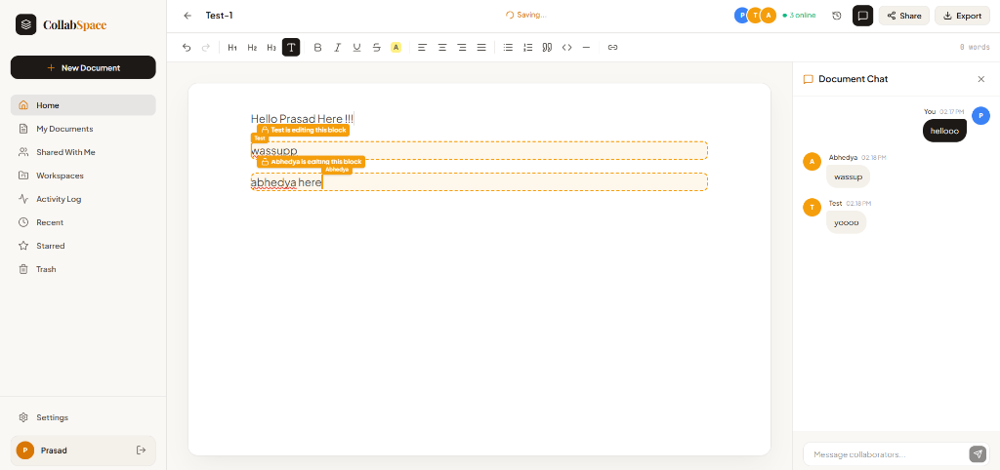
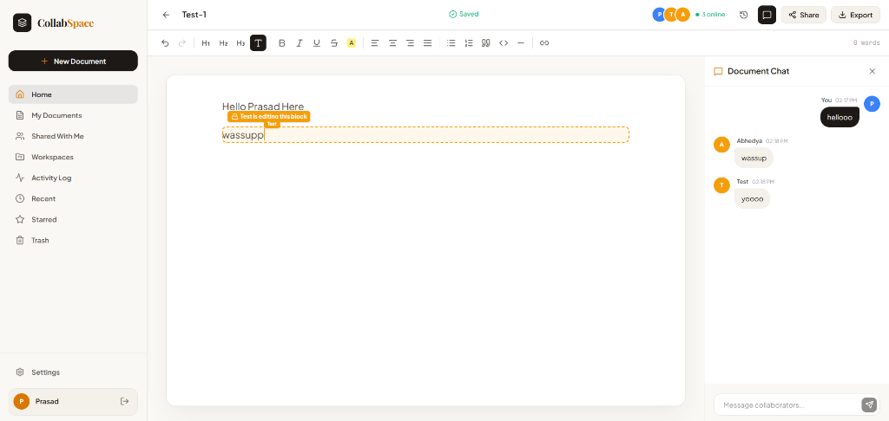
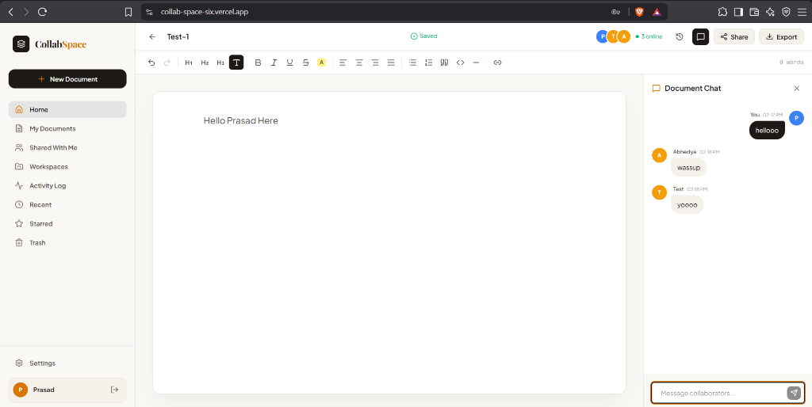
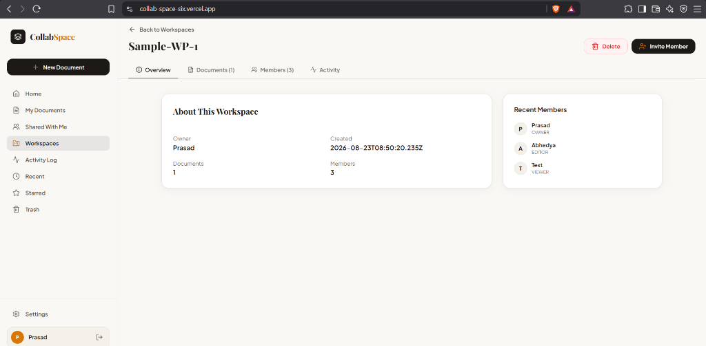
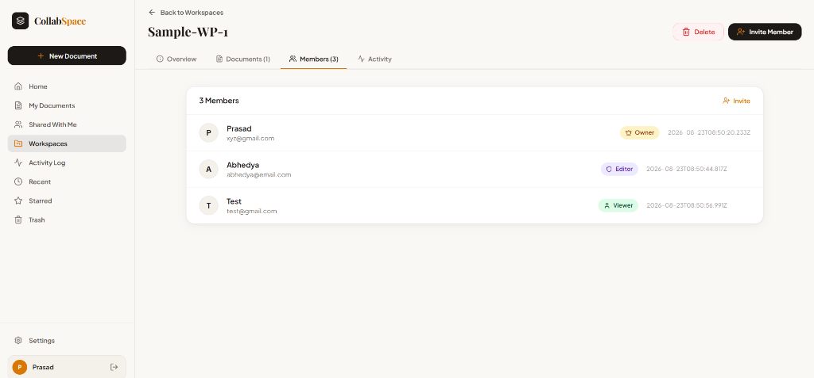
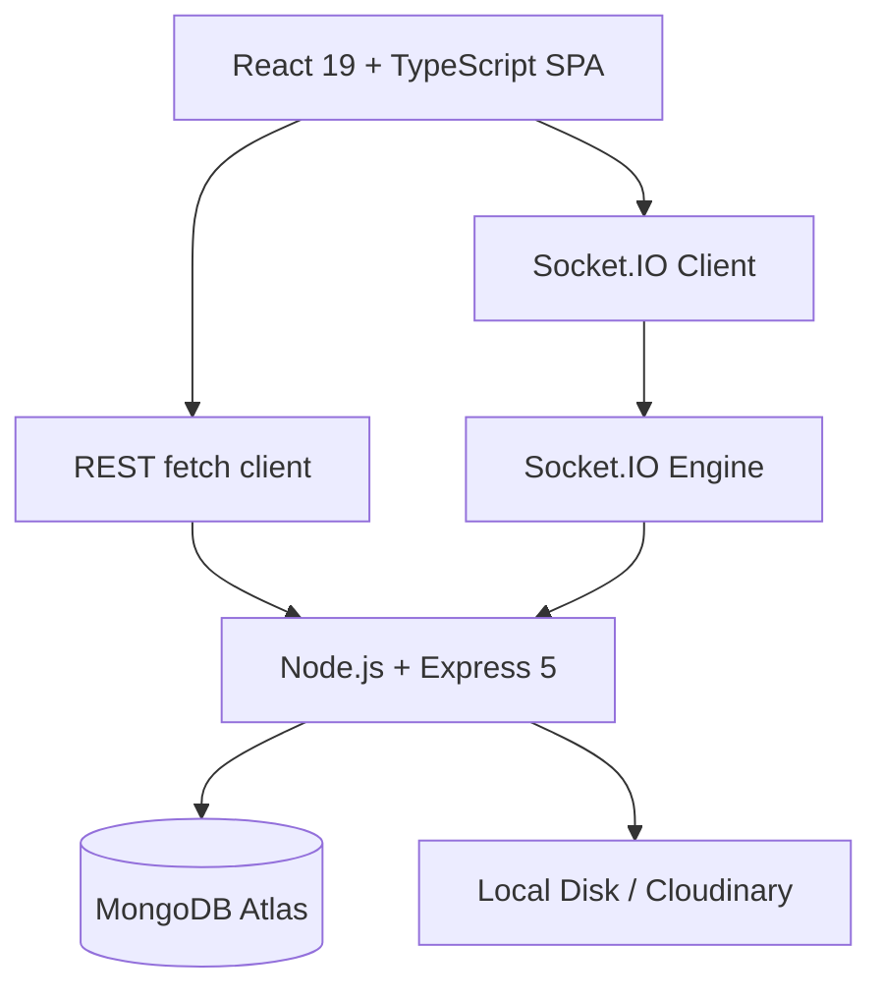

# CollabSpace

A premium, full-stack real-time collaborative document workspace featuring an elegant, human-centric editorial design.

> 🌐 **Live Demo:** [collab-space-six.vercel.app](https://collab-space-six.vercel.app)

## Overview

CollabSpace bridges the gap between structured documentation and real-time collaboration. Users can write, share, and organize documents in a distraction-free editorial environment — with live presence, block-level locking, document chat, and workspace management. Unlike generic SaaS templates, CollabSpace uses a tailored design identity: obsidian + amber color tokens, Playfair Display headings, and Plus Jakarta Sans for UI.

---

## Screenshots

### Real-Time Collaboration — Block Locks Active

*Manually verified: 3 simultaneous users (Prasad, Abhedya, Test) editing document "Test-1". Two blocks locked concurrently — "Test is editing this block" and "Abhedya is editing this block" — while Document Chat shows live messages from all 3 users.*

---

### Document Auto-Save with Block Lock Indicator

*Auto-save confirmed: status transitions "Saving..." → "Saved". Block lock for "Test" user persists. 3 online user avatars visible in the document header.*

---

### Document View from Collaborator's Browser

*Same document session viewed from a separate browser session at the deployed URL. Real-time state is shared across independent clients — same chat history, same save state, same online user count.*

---

### Workspace Overview

*Workspace "Sample-WP-1" with 1 linked document and 3 members: Prasad (Owner), Abhedya (Editor), Test (Viewer). Deployed and connected to MongoDB Atlas.*

---

### Workspace Members with Role Badges

*All 3 workspace roles verified manually: Owner, Editor, and Viewer — each with real email accounts and join timestamps.*

---

## Project Highlights

### Verified Implementation

| Area | Verified Details |
| :--- | :--- |
| **Frontend** | React 19 + TypeScript + Vite SPA |
| **Styling** | Tailwind CSS v4 + Custom Editorial Design Tokens |
| **Rich Text Engine** | TipTap 3 |
| **Backend** | Node.js 20+ + Express 5 |
| **Real-time** | Socket.IO 4 |
| **Database** | MongoDB Atlas via Mongoose 8 |
| **Authentication** | Stateless JWT (Bearer) + bcryptjs |
| **Validation** | Zod 3 Request Schema Validation |
| **File Storage** | Local `/uploads` with optional Cloudinary SDK |
| **Text Extraction** | pdf-parse (PDF → plain text) |

### Code-Derived Metrics

| Metric | Count | Source |
| :--- | :---: | :--- |
| REST API endpoints | 36 | `backend/src/routes/*.ts` + `app.ts` |
| Database Models | 8 | `backend/src/models/*.ts` |
| Socket.IO Client Events | 9 | `backend/src/socket/index.ts` |
| Socket.IO Server Events | 11 | `backend/src/socket/index.ts` |
| Backend Service Modules | 5 | `backend/src/services/*.ts` |
| Frontend Components | 37 | `frontend/src/components/**/*.tsx` |
| System Roles | 3 | `ADMIN`, `MEMBER`, `GUEST` |
| Document Roles | 3 | `OWNER`, `EDITOR`, `VIEWER` |
| Export Formats | 4 | `html`, `markdown`, `docx`, `pdf` |

### Manually Verified (Screenshots)

| Feature | Evidence |
| :--- | :--- |
| Real-time collaboration | 3 simultaneous users in screenshots above |
| Block-level locking | 2 blocks locked by 2 different users at the same time |
| Document Chat | Messages from 3 users visible in the same live chat panel |
| Auto-save | "Saving..." → "Saved" transitions visible across sessions |
| Workspace roles | Owner, Editor, Viewer all shown with real registered accounts |

---

## Key Features

- **Stateless JWT Authentication:** Secure signup and login; tokens verified on every REST and Socket.IO request.
- **TipTap 3 Rich Text Editor:** Headings, bold, italic, underline, strikethrough, text alignment, code blocks, highlights, links, and more.
- **Real-Time Block Locking:** Editors acquire per-paragraph locks. Other users see a named lock indicator. Locks auto-expire after 5 minutes.
- **Live Presence:** Online user avatars displayed in the document header, updated on join/leave.
- **Document Chat Sidebar:** Context-aware chat panel per document, persisted to MongoDB.
- **Manual Version History:** Create and restore named snapshots of document state.
- **Document Export:** Download as HTML, Markdown, or DOCX; browser-native PDF print.
- **Workspace Management:** Create workspaces, invite members with role assignments, manage membership.
- **Audit Activity Log:** Records document, permission, workspace, and export actions.
- **File Upload & Extraction:** Upload PDF, Markdown, and DOCX files with server-side text extraction.
- **Role-Based Route Guards:** Admin console restricted by system role; read-only editor for Viewer and Guest.

---

## Real-Time Collaboration

```
[ User A: Prasad ]         [ User B: Abhedya ]         [ User C: Test ]
       │ (types block 1)          │ (types block 2)          │ (reads)
       ▼                          ▼                          │
[ TipTap Editor ]          [ TipTap Editor ]                 │
       │                          │                          │
       └──────────┐   ┌───────────┘                          │
                  ▼   ▼                                      │
         [ Socket.IO Server ] ◄───────────────────────────────┘
         [ Room: doc:Test-1  ]
                  │
     ┌────────────┼────────────┐
     ▼            ▼            ▼
block:locked  content-     chat:received
broadcast     updated      broadcast
                  │
                  ▼ (debounced 3s)
           [ MongoDB Atlas ]
```

1. **Join:** Client authenticates with JWT, joins `doc:<documentId>` Socket.IO room.
2. **Presence:** Server maintains an in-memory presence map; join/leave events broadcast updated lists.
3. **Block Locks:** Editors emit `block:lock`; server broadcasts `block:locked` to all other room members.
4. **Content Sync:** `document:content-update` broadcasts TipTap HTML; server debounces and saves to MongoDB after 3 seconds.
5. **Chat:** `chat:send` persists to MongoDB and broadcasts `chat:received` to the full room.

---

## Architecture



---

## Tech Stack

| Technology | Purpose |
| :--- | :--- |
| React 19 | SPA UI rendering |
| Vite 8 | Dev server and production bundler |
| Tailwind CSS v4 | Utility-first styling |
| TipTap 3 | Rich text editing engine |
| Node.js 20+ | Backend runtime |
| Express 5 | REST API server |
| Socket.IO 4 | Real-time bidirectional events |
| Mongoose 8 | MongoDB ODM |
| Zod 3 | Request schema validation |
| bcryptjs | Password hashing |
| pdf-parse | PDF text extraction |
| Cloudinary SDK | Optional managed file storage |

---

## Project Structure

```text
backend/
├── src/
│   ├── config/        # Env, DB, Cloudinary setup
│   ├── controllers/   # HTTP request handlers
│   ├── middleware/    # JWT auth, Multer, error handler
│   ├── models/        # 8 Mongoose schemas
│   ├── routes/        # /api/v1/* route definitions
│   ├── services/      # Business logic (auth, docs, workspaces, upload, extraction)
│   ├── socket/        # Socket.IO room, presence, lock, chat handlers
│   ├── validators/    # Zod request schemas
│   └── utils/         # JWT helpers, async wrapper, ApiError
frontend/
├── src/
│   ├── api/           # Typed fetch client + API contract interfaces
│   ├── components/    # 37 UI components (landing, auth, dashboard, editor, workspace)
│   ├── context/       # AuthProvider + session restoration
│   ├── services/      # Frontend service adapters
│   └── types/         # Domain TypeScript types
```

---

## Authentication & Authorization

- Email/password signup; passwords hashed with bcryptjs before storage.
- Login returns a signed JWT stored in `localStorage`.
- All protected REST routes require `Authorization: Bearer <token>`.
- Socket.IO reads the token from `socket.handshake.auth.token`.
- Suspended users are blocked at both REST and Socket.IO middleware.
- Frontend route guards restrict the Admin Console to `ADMIN` system role; `GUEST` users receive a read-only editor.

---

## Document Permissions

| Action | OWNER | EDITOR | VIEWER |
| :--- | :---: | :---: | :---: |
| Edit content & title | ✅ | ✅ | ❌ |
| Acquire block locks | ✅ | ✅ | ❌ |
| Invite collaborators | ✅ | ❌ | ❌ |
| Change access level | ✅ | ❌ | ❌ |
| Create/restore versions | ✅ | ✅ | ❌ |
| Trash document | ✅ | ❌ | ❌ |
| View & send chat | ✅ | ✅ | ✅ |

---

## Socket.IO Events Reference

### Client → Server

| Event | Payload | Purpose |
| :--- | :--- | :--- |
| `document:join` | `{ documentId }` | Join document room |
| `document:leave` | `{ documentId }` | Leave document room |
| `document:cursor-update` | `{ documentId, cursor }` | Broadcast cursor position |
| `block:lock` | `{ documentId, blockId, blockIndex }` | Acquire block edit lock |
| `block:unlock` | `{ documentId, blockId }` | Release block lock |
| `document:content-update` | `{ documentId, html }` | Sync TipTap HTML to room |
| `document:title-update` | `{ documentId, title }` | Sync document title |
| `chat:send` | `{ documentId, content }` | Send chat message |
| `disconnect` | — | Clear presence & release locks |

### Server → Client

| Event | Scope | Purpose |
| :--- | :--- | :--- |
| `document:presence` | Room | Updated online user list |
| `document:user-joined` | Others | New user joined notification |
| `document:user-left` | Others | User disconnected cleanup |
| `document:cursor-updated` | Others | Move collaborator cursor |
| `document:content-updated` | Others | Apply remote HTML content |
| `document:title-updated` | Others | Update title bar |
| `document:role-updated` | Room | Permission changed |
| `document:access-revoked` | Room | Access removed |
| `block:locked` | Others | Show named lock indicator |
| `block:unlocked` | Others | Remove lock indicator |
| `chat:received` | Room | Append chat message |

---

## Database Models

| Model | Responsibility |
| :--- | :--- |
| `User` | Credentials, system role, status, avatar |
| `Document` | Content, owner, collaborators, stars, trash state |
| `DocumentVersion` | Manual snapshots for version restore |
| `Workspace` | Workspace metadata, owner, members |
| `Invitation` | Pending/accepted workspace invitations |
| `Activity` | Audit log entries |
| `ChatMessage` | Per-document persistent chat |
| `OrgSettings` | Public link policy, 2FA/SSO/session config |

---

## REST API Reference

All routes are prefixed with `/api/v1`. Protected routes require `Authorization: Bearer <token>`.

**Auth:** `POST /auth/signup` · `POST /auth/login` · `POST /auth/logout` · `GET /auth/me`

**Documents:** `POST /documents` · `GET /documents` · `GET /:id` · `PATCH /:id` · `DELETE /:id` · `DELETE /:id/permanent` · `POST /:id/restore` · `POST /:id/star` · `POST /:id/join` · `POST /:id/collaborators` · `PATCH /:id/collaborators/:userId` · `DELETE /:id/collaborators/:userId` · `PATCH /:id/access` · `POST /:id/versions` · `GET /:id/versions` · `GET /:id/versions/:versionId` · `GET /:id/export/:format`

**Workspaces:** `POST /workspaces` · `GET /workspaces` · `GET /:id` · `GET /:id/members` · `DELETE /:id/members/:userId` · `POST /:id/invitations` · `DELETE /:id`

**Invitations:** `GET /invitations` · `POST /:id/accept` · `POST /:id/reject`

**Chat:** `GET /documents/:id/chat`

**Activities:** `GET /activities`

**Uploads:** `POST /upload/avatar` · `POST /upload/document`

---

## Testing

No automated test suite is currently configured. Verification commands:

```bash
# Backend
npm run typecheck   # TypeScript type-check
npm run build       # Compile to dist/

# Frontend
npm run build       # TypeScript + Vite build
npm run lint        # oxlint static analysis
```

---

## Local Development

**Requirements:** Node.js 20+ and a MongoDB connection string.

```bash
# 1. Clone
git clone https://github.com/Prasad-codes001/CollabSpace.git
cd CollabSpace

# 2. Backend
cd backend
npm install
cp .env.example .env   # fill in MONGODB_URI and JWT_SECRET
npm run dev            # starts on http://localhost:8000

# 3. Frontend (new terminal)
cd frontend
npm install
cp .env.example .env   # set VITE_API_BASE_URL=http://localhost:8000/api/v1
npm run dev            # starts on http://localhost:5173
```

---

## Environment Variables

### Backend (`backend/.env`)

| Variable | Required | Purpose |
| :--- | :---: | :--- |
| `MONGODB_URI` | Yes | MongoDB connection string |
| `JWT_SECRET` | Yes | JWT signing secret |
| `PORT` | No | Server port (default `8000`) |
| `CORS_ORIGIN` | No | Allowed frontend origin (default `http://localhost:5173`) |
| `CLOUDINARY_CLOUD_NAME` | No* | Cloudinary storage |
| `CLOUDINARY_API_KEY` | No* | Cloudinary storage |
| `CLOUDINARY_API_SECRET` | No* | Cloudinary storage |

\*All three required together to enable Cloudinary. Otherwise files write to local `uploads/`.

### Frontend (`frontend/.env`)

| Variable | Required | Purpose |
| :--- | :---: | :--- |
| `VITE_API_BASE_URL` | Yes | Backend API base (e.g. `http://localhost:8000/api/v1`) |
| `VITE_USE_MOCK_API` | No | `true` to use mock services, `false` to call the real API |

---

## Known Limitations

- **Event-Based Sync Only:** Content synchronization uses lock-based broadcasts, not CRDT or OT. Simultaneous character-level edits on the same block by two users can conflict and may require manual resolution.
- **Single-Instance Presence:** Socket.IO presence and block lock state are stored in process memory. Running multiple server instances requires a shared adapter (e.g. Redis) to maintain consistent room state across nodes.

---

## License

No license is currently declared or included in the repository.